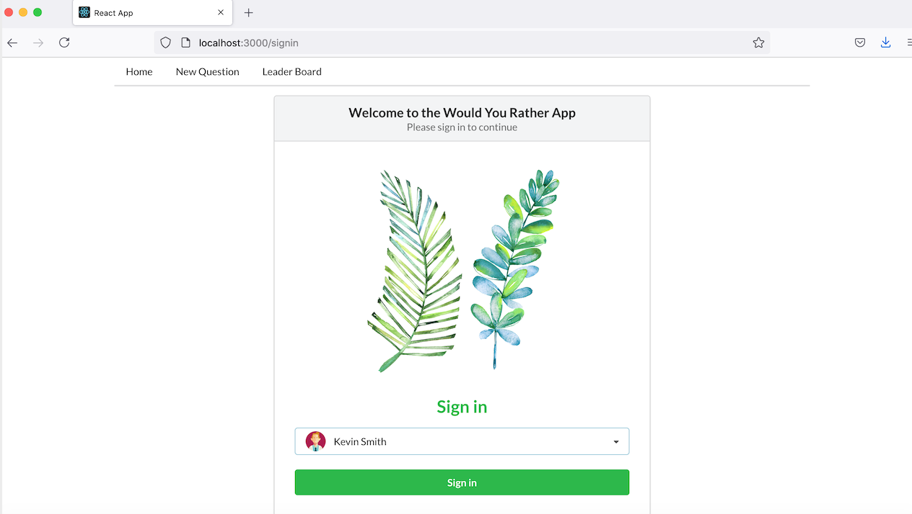
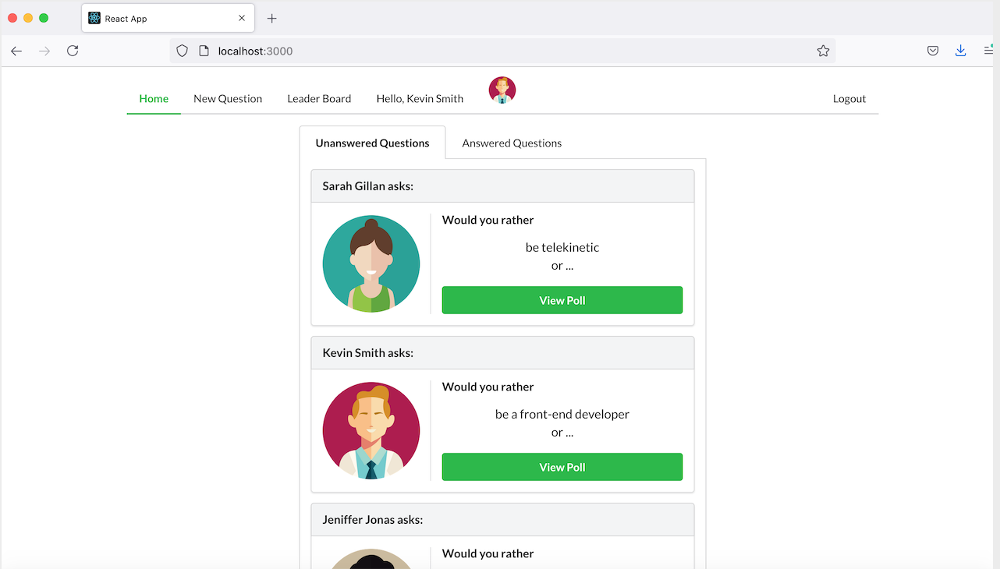
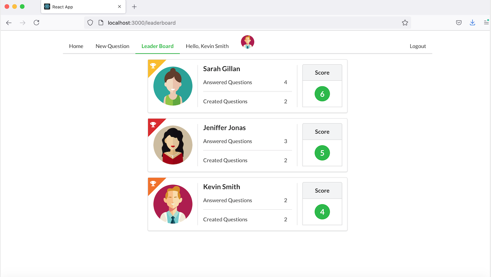

# Would You Rather

"Would You Rather" is a fully responsive and mobile-ready polling game app that presents the user with a series of questions. The game goes like this: A user is asked a question in the form: “Would you rather [option A] or [option B] ?”. Answering "neither" or "both" is against the rules. In the app, users will be able to answer questions, see which questions they haven’t answered, see how other people have voted, post questions, and see the ranking of users on the leaderboard.

It's built with React, Redux, React Router, Redux Thunk, and Semantic UI React.

## Demo


## Screenshots





## Installation

Clone the repository, change directories, and use yarn to install the dependencies.

```bash
$ git clone https://github.com/mengligit/react-would-u-rather.git
$ cd react-would-u-rather
$ yarn install
```

## Usage

The project can be run with

- `yarn start`

The project can be viewed in the browser at

- [http://localhost:3000](http://localhost:3000)


